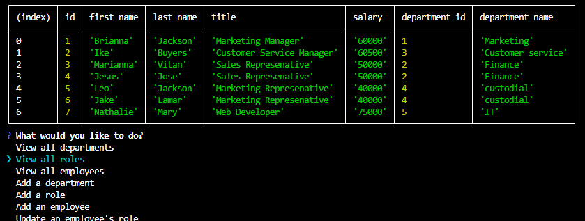

## Employee-Tracker Video
View here for the video: https://drive.google.com/file/d/1Oy_ll3kVZZbpbf4YkpMYheb9_bzsmXrO/view?usp=drive_link

### Built With

<!--  Add any additional badges as needed. For more info, visit: https://github.com/404pandas/empty-resources/blob/main/assets/images/shields.md -->

## Description

Welcome to my Employee Tracker System!
This application will help buisness owners manage and view their departments, roles, and employee directory in their company for organizational and business purposes. This project has help me better understand Node.js, Express, and PostgreSQL.

## Table of Contents 

- [Installation](#installation)
- [Usage](#usage)
- [License](#license)
- [Contribute](#how-to-contribute)
- [Questions](#questions) 

## Installation

To use the Employee Tracker, please follow these steps:
1. Clone the Repo at git clone https://github.com/BriannaVitan/Employee-Tracker
2. On your Cil, Install the Inquirer package: npm i inquirer@8.2.4
3. Set up the PostgreSQL database: psql -U postgres
4. Create a new database: CREATE DATABASE employee_db;
5. Connect to Database: \c employee_db;
6. Run the schema.sql file to create the necessary tables: \i schema.sql
7. Run the Seeds the database: \i seeds.sql

## Usage

## License

This project is licensed under the MIT license. See LICENSE.txt for more information.

## How to Contribute

Contributions are welcomed and greatly appreciated. If you have a suggestion, please fork the repo and create a pull request. Thank you in advance!

## Contact

If you have any additional questions, please reach me at https://github.com/BriannaVitan/Employee-Tracker
